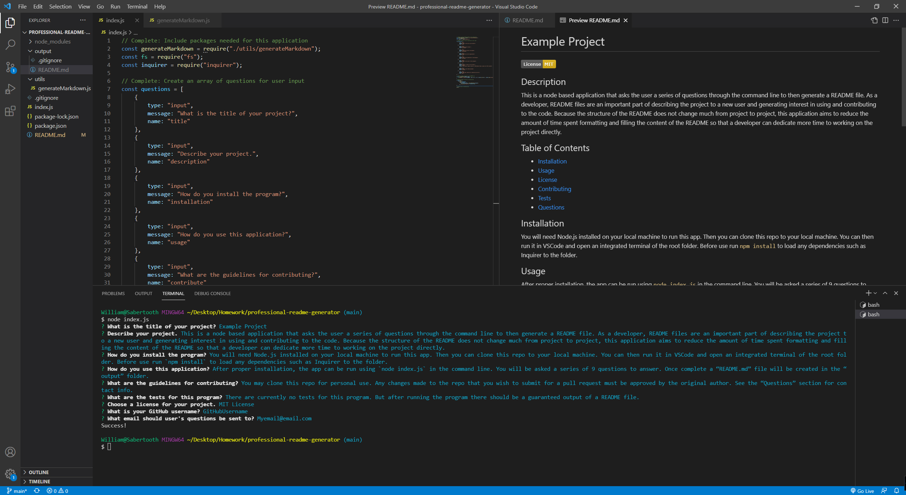

# Professional README Generator

[](https://opensource.org/licenses/MIT)

## Description
This is a node based application that asks the user a series of questions through the command line to then generate a README file. As a developer, README files are an important part of describing the project to a new user and generating interest in using and contributing to the code. Because the structure of the README does not change much from project to project, this application aims to reduce the amount of time spent formatting and filling the content of the README so that a developer can dedicate more time to working on the project directly.

In building this application, I learned how to create new files locally through Node fs and how to import dependencies for my app such as Inquirer which was used for the command line interface with the user.



## Table of Contents

- [User Story](#user-story)
- [Walkthrough Video](#walkthrough-video)
- [Example Generated README.md](#example-generated-readmemd)
- [Installation](#installation)
- [Usage](#usage)
- [Technologies](#technologies)
- [License](#license)
- [Contact](#contact)

## User Story
```
AS A developer
I WANT a README generator
SO THAT I can quickly create a professional README for a new project
```

## Walkthrough Video

https://www.youtube.com/watch?v=Vh3lNQ9EpcA&ab_channel=WilliamCrownover

## Example Generated README.md

https://drive.google.com/file/d/1SLn7x01JNAKGniovVHXcNb7S2Uz_DKBp/view?usp=sharing 

## Installation
You will need Node.js installed on your local machine to run this app.
Then you can clone this repo to your local machine.
You can then run it in VSCode and open an integrated terminal of the root folder.
Before use run `npm install` to load any dependencies such as Inquirer to the folder.

## Usage
After proper installation, the app can be run using `node index.js` in the command line.
You will be asked a series of 9 questions to answer.
Once complete a “README.md” file will be created in the “output” folder.

Special note, if you choose “No License” on question 7, then that section will be skipped over and won’t be included in the table of contents.

## Technologies
- Node.js
- Inquirer

## License
Licensed under the MIT License - https://opensource.org/licenses/MIT

## Contact

If you have any questions you can email me at williamcrownover1@gmail.com.


You can also check out my other work on GitHub at [WilliamCrownover](https://github.com/WilliamCrownover)
